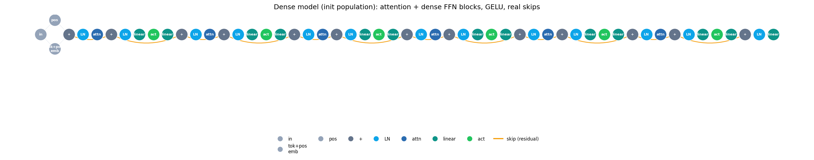
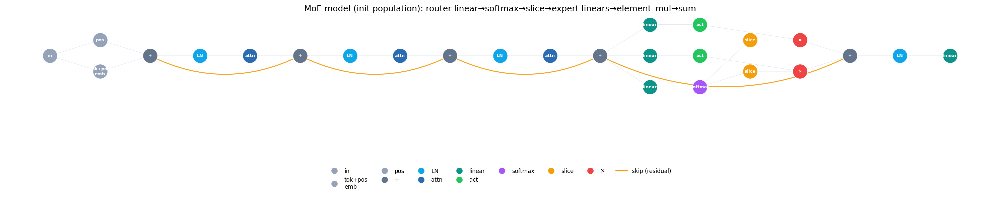

# Autonomous Free-Graph Architecture Search for Language Models

Research codebase (NeurIPS 2026 draft). It performs multi-objective **neural architecture search
(NAS)** for decoder-only language models, where each architecture is a **Heterogeneous Directed
Acyclic Graph (H-DAG)** of primitive nodes, compiled and trained on the fly.

This branch (`real-graph-search`) runs a **fully-free atomic graph search**: an LLM agent
(Metis, **Claude-backed**) evolves the architectures as *raw graphs of primitive atoms*. There are
**no prescribed attention / FFN / MoE blocks** — every structure, including a mixture-of-experts, a
gate, or a mixer nobody has tried, must **emerge from wiring atoms**. Only `causal_attention` is kept
as a single token-mixing primitive.

---

## What we are doing

- **The genome is the graph itself** — the raw `(nodes, edges)` H-DAG (not a fixed-length vector).
- Each generation the agent is shown the current Pareto front and emits a **graph-edit program** —
  generic atomic operations only: `add_node` / `add_edge` / `remove_node` / `remove_edge` over the
  primitive vocabulary. Every edited graph is pruned to the input→head live set and DAG-validated;
  anything that still fails at runtime is rejected by the trainer.
- **Lamarckian weight inheritance**: a child copies weight tensors in-place from its parent, so it
  resumes training rather than restarting.
- Only the **I/O is fixed** (token + positional embeddings in, LM head out); everything between is free.

### Objectives (both minimized) → a Pareto front
1. **Validation cross-entropy loss** (WikiText-103, 1 epoch per candidate).
2. **Active-FLOPs per token** — the compute that actually runs. Parameter count is *not* an objective.

### Hard constraints (a violator is rejected by design, not given a fake loss)
- **Peak training memory < 12 GB** (measured; OOM → clean rejection).
- **Validation loss < 4.5** (kills degenerate near-empty models).
- **At least 3 compute atoms** (no trivial models).

### Mixture-of-Experts is *emergent*, not a block
There is no `moe_ffn` node. A **real sparse MoE composes from primitives**: a router
(`linear → softmax → top_k`), each expert a `linear`/`activation` chain run on a `gather`'d token
subset, and `scatter_add` to recombine — so only the active experts compute and the FLOP metric is
real. The dynamic-dispatch atoms (`top_k`, `gather`, `scatter_add`) are what make this possible; see
the primitive tables below.

### Initial population
20 graphs: **5 GPT-2-family seeds** (incl. two saved elites) + **15 diverse explorers**
(front-loaded attention, non-uniform FFN placement, mixed activations, real skip connections). Several
explorers are additionally seeded with an **emergent softmax gate** and an **atom-composed MoE**
(built from `linear`/`softmax`/`slice`/`element_mul`/`sum`), so those structures are in the gene pool
from the start. A per-gene **saturation monitor** injects diversity if a variable freezes across the
population.

### Two example graphs from the initial population
Both are read straight from the compiled `(nodes, edges)`; nodes are colored by primitive type and
amber edges are long-range residual skips.

**Dense model** — attention (`LN→attn→+`) and dense FFN (`LN→linear→act→linear→+`) blocks with skips:



**MoE model** — the mixture-of-experts is composed entirely from atoms (router `linear→softmax`,
per-expert `slice→×` gating over `linear→act` experts, recombined by `+`) — no monolithic block:



---

## Layout

- `rwnn/nodes.py` — the atomic primitive modules (embeddings, causal attention, linear, layernorm,
  activation, sum, element_mul, softmax, slice, top_k, gather, scatter_add, …).
- `rwnn/graph.py` — `RWNNGraph`: topologically compiles `(nodes, edges)`, auto-projects on dimension
  mismatch (and broadcasts width-1 inputs), executes as an `nn.Module`.
- `rwnn/mutator.py` — DAG validity checks and structural `GraphMutator` operators.
- `evolve_graph_search.py` — **main script**: the seed encoder/decoder + trainer (self-contained),
  the atomic graph-edit ops, the Claude edit-program agent, and the generation loop
  (`run_graph_search`). Objectives = loss vs active-FLOPs; the constraints above; Pareto front,
  reports, and plots.
- `agentic_optimizer/` — vendored Metis agent + `claude_llm.py` (Claude Agent SDK → local `claude` CLI).
- `checkpoints/graph-search/` — per-generation outputs: `graph_gen{G}_ind{I}_config.json` (the **full**
  `nodes`/`edges` + loss/active-FLOPs/params/summary), the current front's weight `.pt` files,
  `generation_{G}_report.json`, and Pareto PNGs.

---

## Running

```bash
conda activate RWNNLMM
python evolve_graph_search.py     # or: nohup python -u evolve_graph_search.py > agentic_evolution.log 2>&1 &
```

The agentic optimizer is **vendored** in `agentic_optimizer/` and backed by **Claude**: install the
SDK (`pip install claude-agent-sdk`) and make sure the local `claude` CLI is logged in (subscription;
no API key needed). Choose the model with `CLAUDE_MODEL` (default `sonnet`). You also need
`train.bin` / `val.bin` (from `prepare_wikitext103.py`). Set
`PYTORCH_CUDA_ALLOC_CONF=expandable_segments:True` before launching to reduce fragmentation on a
12 GB card. Note: `run_graph_search()` clears `checkpoints/graph-search/` on startup.

---

## Expressiveness: how few primitives do we really need?

A feedforward network is just an **arithmetic circuit** — a DAG of math ops — so a small primitive set
is *universal* (universal approximation + any fixed-size computation). You do **not** need `linear`,
`attention`, `layer_norm`, or `moe` as primitives; they are all compositions.

**To express all fixed-shape modern nets you need ≈12 primitives:** elementwise `add`/`mul` (+ `neg`/
`recip`), a few unary functions (`exp`, `relu`/`gelu`, `sqrt`, and `sin`/`cos` — which buy you RoPE),
**learnable parameters** (weight-tensor leaves), a **reduction over an axis** (`reduce_sum` — this is
what turns elementwise multiply into a *contraction*/matmul, and hence enables linear layers,
attention, and normalization means), **shape/axis ops** (`reshape`/`transpose`/`broadcast`), and
**`gather`** (embeddings, indexing). From these: `linear` = broadcast-multiply + reduce; `softmax` =
exp + reduce + divide; `layernorm`/`rmsnorm` = mul + reduce + sqrt + divide; `attention` = two
contractions + softmax + a causal mask + reshape-for-heads. Pure "sum/max/mul/div/sin/cos" is *not*
quite enough on its own — those are elementwise and parameter-free, so they can neither **learn**
(no params) nor **mix** information across channels/tokens (no reduction-over-axis); adding params +
a reduction + shape/gather is what unlocks everything.

**Two things no set of math nodes can express** — they are control-flow/memory, not arithmetic:
- **Dynamic dispatch** — real *sparse* top-k MoE (skip the experts that don't fire). A static circuit
  computes everything and can only *mask*; genuine compute-savings need data-dependent execution.
- **Scan / sequential state** — SSM / Mamba / RWKV / linear-attention recurrences, where step *t*
  depends on step *t-1*. Attention avoids this by being a parallel contraction; true recurrence needs
  a `scan`/loop primitive (or unrolling to a fixed length).

The repo deliberately keeps a couple of **"chunky" primitives** (`linear`, `causal_attention`) rather
than only the ~12 fine-grained ones — not because the fine set is insufficient, but for
(a) **speed/stability** (a fused matmul/attention kernel beats one emulated from broadcast-mul+reduce)
and (b) **searchability** (an agent will not rediscover attention from raw reductions, and most
fine-grained random wirings aren't even shape-valid). MoE, by contrast, is *not* shipped as a block —
it is composed from the dispatch atoms (`top_k`/`gather`/`scatter_add`), so the search owns it end to end.

## Primitive vocabulary (as implemented in `rwnn/nodes.py`)

Tensors flow as `[B, T, C]` (batch, tokens, channels; `C = d_model = 768`). The compiler
(`RWNNGraph`) auto-inserts a linear projection on any dimension mismatch and lets a width-1 input
broadcast, so wirings are forgiving. `input`, `token_embedding`, `positional_embedding`, and the LM
head (a `linear` at node 13) are the fixed I/O anchors.

### I/O anchors (fixed; never removed by the search)
| `type` | kwargs | inputs → output | what it is |
|---|---|---|---|
| `input` | — | token ids `[B,T]` → `[B,T]` | placeholder holding the raw token ids |
| `token_embedding` | `vocab_size, d_model` | ids `[B,T]` → `[B,T,d]` | learned token embedding (a gather over a weight table) |
| `positional_embedding` | `max_seq_len, d_model` | `[B,T,*]` → `[B,T,d]` | learned absolute position embedding (uses only `T`) |
| (LM head) | `d_in, d_out=vocab` | `[B,T,d]` → `[B,T,vocab]` | a `linear` at node 13 producing logits |

### Arithmetic / functional primitives  (compute or transform *values*; † = has learnable parameters)
| `type` | kwargs | inputs → output | what it is |
|---|---|---|---|
| `linear` † | `d_in, d_out, bias` | `[B,T,d_in]` → `[B,T,d_out]` | affine map `xW+b` — a contraction over channels |
| `matmul` † | `d_in, d_out` | `[B,T,d_in]` → `[B,T,d_out]` | linear map without bias (`F.linear(x, W)`) |
| `causal_attention` † | `n_head, d_model, dropout` | `[B,T,d]` (or Q,K,V) → `[B,T,d]` | masked multi-head self-attention (QKV+proj inside) — a *chunky* token mixer |
| `causal_batch_matmul` | `scale` | Q,K `[B,H,T,d]` → `[B,H,T,T]` | `Q·Kᵀ·scale` + causal mask (to build attention from atoms) |
| `layer_norm` † | `d_model, eps` | `[B,T,d]` → `[B,T,d]` | LayerNorm w/ affine (*chunky*; composable from square/mean_reduce/sqrt/divide/scale_shift) |
| `scale_shift` † | `d_model` | `[B,T,d]` → `[B,T,d]` | learned per-channel affine `x·γ+β` (LN/RMSNorm affine) |
| `add_bias` † | `d_model` | `[B,T,d]` → `[B,T,d]` | add a learned per-channel bias |
| `activation` | `act_type: gelu\|silu\|relu` | `[B,T,C]` → `[B,T,C]` | elementwise nonlinearity |
| `softmax` | `dim=-1` | `[B,T,C]` → `[B,T,C]` | softmax over the last dim (routers/gates) |
| `sum` | — | N×`[B,T,C]` → `[B,T,C]` | elementwise add of ALL inputs (residual/merge; extra inputs = skips) |
| `element_mul` | — | N×`[B,T,C]` → `[B,T,C]` | elementwise product (width-1 input broadcasts → gating) |
| `mean_reduce` | `dim=-1` | `[B,T,C]` → `[B,T,1]` | mean over an axis — the reduction/contraction atom |
| `square` | — | `[B,T,C]` → `[B,T,C]` | elementwise `x²` |
| `sqrt` | `eps` | `[B,T,C]` → `[B,T,C]` | elementwise `√(x+eps)` |
| `subtract` | — | 2×`[B,T,C]` → `[B,T,C]` | `inputs[0] - inputs[1]` |
| `divide` | — | 2×`[B,T,C]` → `[B,T,C]` | `inputs[0] / inputs[1]` (broadcasts) |
| `dropout` | `dropout` | `[B,T,C]` → `[B,T,C]` | stochastic zeroing (train only) |

### Data-movement & indexing primitives  (rearrange / select / route data; ⚡ = data-dependent = dynamic dispatch)
| `type` | kwargs | inputs → output | what it is |
|---|---|---|---|
| `concat` | `dim=-1` | N×`[B,T,Cᵢ]` → `[B,T,ΣCᵢ]` | concatenate along a dim |
| `slice` | `start, end` | `[B,T,C]` → `[B,T,end-start]` | select a channel range (extract one gate: `slice(i,i+1)`) |
| `transpose` | `dim1, dim2` | `[…]` → axes swapped | swap two axes |
| `reshape` | `shape` | `[…]` → reshaped | reshape the tensor (e.g. split channels into heads) |
| `top_k` ⚡ | `k` | `[B,T,E]` → `[B,T,E]` | keep the k largest gate weights (others 0), renormalized → **sparse routing** |
| `gather` ⚡ | `dim=1` | data `[…]`, int idx → `[…]` (fewer rows) | select rows by data-dependent indices → **route a token subset to an expert** (this is what makes a downstream `linear` compute fewer rows = real FLOP saving) |
| `scatter_add` ⚡ | `dim=1` | target, int idx, src → `[…]` | add routed/expert outputs back to their positions → **recombine** |

The ⚡ trio (`top_k`, `gather`, `scatter_add`) is the **dynamic-dispatch family** — the "data-movement with
data-dependent indices" that plain arithmetic atoms cannot express. With them a **real sparse MoE composes
from primitives** (router `linear→softmax→top_k`; each expert a `linear`/`activation` chain run on a
`gather`'d token subset; `scatter_add` to recombine), so only the active experts compute and the FLOP metric
is real — no monolithic block required. Still absent (frontier gaps): `sin`/`cos` (RoPE), grouped/latent
attention (GQA/MQA/MLA), and a `scan`/state op (SSM/Mamba recurrence).

---

## Citation

```bibtex
@inproceedings{kyriacou2026lamarckian,
  title={Lamarckian Weight Inheritance in Autonomous H-DAG Large Language Models},
  author={Kyriacou, Stylianos},
  booktitle={Neural Information Processing Systems (NeurIPS 2026)},
  year={2026}
}
```
