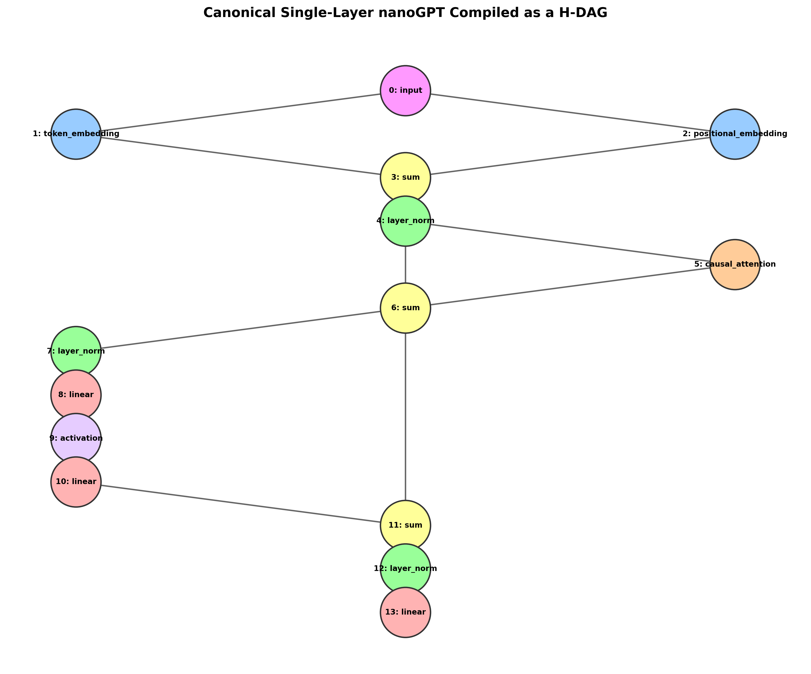
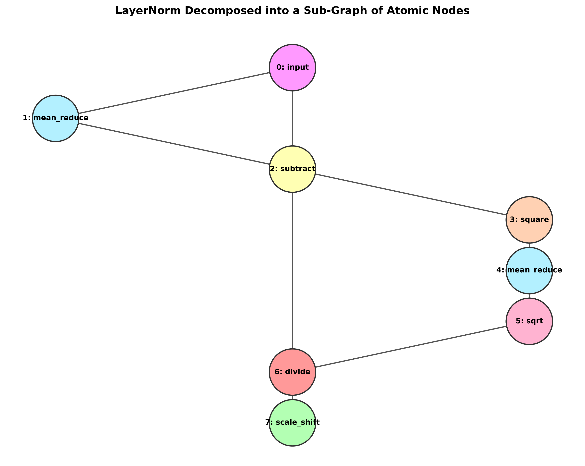

# Randomly Wired Neural Networks as Large Language Models (RWNN-LLM)

## 🎯 Goal
The goal of this project is to implement, train, and optimize **Randomly Wired Neural Networks (RWNNs)** in the domain of **Large Language Models (LLMs)**.

Specifically, we design a framework where a decoder-only language model is modeled as a **Heterogeneous Directed Acyclic Graph (H-DAG)**. Within this graph:
- **Nodes** represent primitive modular tensor operations.
- **Edges** represent communication pathways where hidden states flow.

By representing an LLM as a modular H-DAG, we can completely discard human-designed, homogeneous sequential architectures (like the standard stack of Transformer blocks in `nanoGPT`) and use a **Memetic Algorithm (Multi-Objective Evolutionary Algorithm + Gradient-Based Backpropagation)** to randomly or optimally wire the network. This allows us to search the structural frontier and find high-efficiency, low-complexity models.

---

## 🏗️ Architectural Foundations

### 1. Coarse-Grained Heterogeneous Graph Nodes (H-DAG)
We define a library of coarse-grained, macro-level nodes operating on 3D sequence tensors of shape `[Batch, SeqLen, Channels]`:
- **Embedding Nodes**: `TokenEmbeddingNode`, `PositionalEmbeddingNode`
- **Parameterized Projections**: `LinearNode(d_in, d_out)`
- **Attention Modules**: `CausalAttentionNode(n_heads, d_model)`
- **Normalization & Non-linearities**: `LayerNormNode`, `ActivationNode(GELU/SiLU)`
- **Combinators**: `SumNode` (Residual addition), `ConcatNode`, `ElementMulNode` (Gating)

### 2. Micro-Level Atomic Mathematical Nodes
To allow true evolutionary emergence where the algorithm can invent new normalization layers and attention variants from first principles, we also define a complete library of **atomic mathematical operations**:
- **Reducers & Powers**: `MeanReduceNode(dim=-1)`, `SquareNode`
- **Arithmetic**: `SubtractNode`, `DivideNode`, `SqrtNode(eps=1e-5)`
- **Learnable Variables**: `ScaleShiftNode(d_model)` (learnable $\gamma, \beta$), `MatMulNode(d_in, d_out)`, `AddBiasNode(d_model)`
- **Formatting**: `TransposeNode(dim1, dim2)`, `ReshapeNode(shape)`
- **Sequence Mixers**: `CausalBatchMatMulNode(scale=1.0)` (batch matrix multiplication with causal triangular masking)

### 3. Lazy Edge Projections (Dimension Alignment)
In a randomly wired network, a mutation might add a connection between two nodes with mismatched channel dimensions. To make the architecture fully robust to arbitrary structural mutations, we wrap every edge in an `EdgeConnection` module:
- It checks the source and target dimensions dynamically.
- If dimensions match, it is a zero-cost pass-through (`Identity`).
- If dimensions mismatch, it lazily instantiates a learnable `nn.Linear` projection without bias, ensuring shape consistency.

### 4. GPU-Parallelized Topological Execution & Broadcasting Bypass
To resolve the sequential bottleneck of arbitrary graphs, we compile the H-DAG into **topological levels**:
- All nodes in a given level $L_r$ are computationally independent and evaluated in parallel.
- **Broadcasting Bypass**: If a source node outputs a dimension of **1** (e.g., from an atomic `MeanReduceNode`), and the target node does not explicitly require a fixed dimension != 1, the compiler bypasses projection and assigns an `Identity()` mapping. This allows PyTorch's native, highly efficient **vectorized broadcasting** (e.g. `[B, T, 128] - [B, T, 1]`) at runtime without compiling redundant parameters.

---

## 🧩 1. The Transformer Block as a Graph

In our RWNN framework, a standard decoder-only Transformer block is represented as a specific self-contained subgraph. For any layer $l$, we generate **8 nodes and 10 edges** to construct the block:

```text
                  [Node 0: Input Token Indices]
                        /               \
         [Node 1: TokenEmbedding]   [Node 2: PositionalEmbedding]
                        \               /
                    [Node 3: Sum Node (WTE + WPE)]
                       /                 \
                      /             [Node 4: LayerNorm 1]
                     /                        |
                    /               [Node 5: CausalAttention]
                   /                          |
         [Node 6: Sum Attention Residual] <---/
                   / \
                  /   \             [Node 7: LayerNorm 2]
                 /     \                      |
                /           [Node 8: Linear MLP Expansion (4xD)]
               /                              |
              /                     [Node 9: GELU Activation]
             /                                |
            /               [Node 10: Linear MLP Contraction (D)]
           /                                  |
    [Node 11: Sum MLP Residual] <------------/
           |
   [Repeat Layers 1-5]
           |
    [Node 64: Final LayerNorm]
           |
    [Node 13: LM Output Head]
```

A complete visual representation compiled using NetworkX is available here:



---

## ⚛️ 2. Deconstructing Modules into Atomic Graphs

To unlock full emergent architecture search, our compiler can deconstruct complex hand-designed modules like `LayerNormNode` into **atomic mathematical sub-graphs**:

### LayerNorm Deconstruction (8 Atomic Nodes, 9 Edges)
Standard LayerNorm is defined as:
$$\text{LayerNorm}(x) = \frac{x - \text{mean}(x)}{\sqrt{\text{var}(x) + \epsilon}} \odot \gamma + \beta$$

We compile it as the following DAG of atomic nodes:



We validated this atomic deconstruction in `verify_atomic_layernorm.py` against PyTorch's native `nn.LayerNorm`:
1.  **Forward Pass**: Maximum absolute numeric difference of **$4.768 \times 10^{-7}$** (100% precision matching).
2.  **Backward Pass**: Maximum absolute numeric gradient difference of **$7.629 \times 10^{-6}$** (100% autograd matching).

---

## 📈 3. Side-by-Side Convergence Comparison (Tiny Shakespeare 5k)

We trained the RWNN H-DAG replica of the 6-layer `toy` configuration (10.8M parameters) on the character-level Tiny Shakespeare corpus for exactly **5,000 steps** on an **NVIDIA RTX 4070 Ti (12GB)**:

```text
Loss
5.0 ┼  
    │  T = Train Loss
4.0 ┼  [T,V]  
    │  
3.0 ┼          [T,V]                                                   V  (Val Divergence/Overfitting)
    │                                                              V
2.0 ┼                  V       V       V                       V
    │                                              V
1.0 ┼                          T       T
    │                                      T
0.0 └─┼──────┬──────┬──────┬──────┬──────┬──────┬──────┬──────┬──────┬──────┬───► Iteration
     0      500    1000   1500   2000   2500   3000   3500   4000   4500   5000
                                                T
                                                        T
                                                                T      T      T  (Train converges to 0.10!)
```

### Convergence & Overfitting Analysis:
*   **Validation Floor**: Reached a validation loss of **1.5557** at iteration 1000 (reproducing the official nanoGPT baseline floor of **1.4697**).
*   **Overfitting Profile**: Due to the small size of the corpus, training loss plummeted to **0.1061** at iteration 5000 while validation loss diverged back to **4.5037**. This perfectly reproduces the exact overfitting trajectory of nanoGPT without heavy dropout.

---

## ⚡ 4. Hardware Throughput

Our parallelized topological compiler enables consumer GPUs to achieve near-datacenter throughput:
*   **nanoGPT Baseline (Institutional A100)**: ~300,000 tokens/sec.
*   **Our RWNN H-DAG (RTX 4070 Ti)**: **168,432 tokens/sec** at peak (97.3 ms/step at a batch size of 64 and block size of 256).

---

## ⚙️ Project Structure
```text
rwnn-llm/
├── README.md               # This project documentation
├── assets/                 # Generated Graph Visualizations (NetworkX)
│   ├── nanogpt_dag_graph.png
│   └── layernorm_atomic_graph.png
├── rwnn/
│   ├── __init__.py
│   ├── nodes.py            # Primitive H-DAG Nodes (Macro & Atomic primitives)
│   ├── graph.py            # RWNNGraph compiler, dimension tracing & execution engine
│   └── mutator.py          # Evolutionary operations (Mutation, Crossover, Cycle Checks)
├── train.py                # Cosine-annealed mixed-precision training pipeline on Tiny Shakespeare
├── evolve.py               # Multi-objective Memetic Optimization engine
├── verify.py               # Autograd verification tests
├── verify_gpt2.py          # 12-layer 163M parameter scaling test
└── verify_atomic_layernorm.py # Numeric precision test for atomic-deconstruction graphs
```
