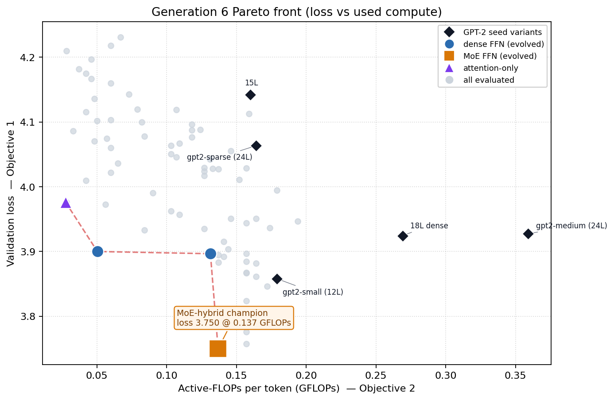
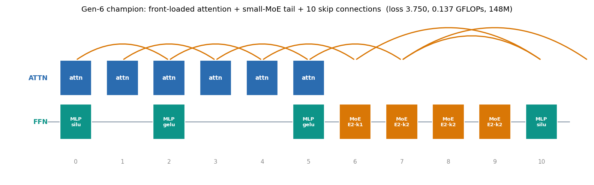

# An LLM Agent Rediscovers the Modern Transformer from GPT-2

The distance between GPT-2 (2019) and today's frontier open models — [Qwen](https://arxiv.org/abs/2505.09388), [Kimi K2](https://arxiv.org/abs/2507.20534), [DeepSeek-V3](https://arxiv.org/abs/2412.19437) — is, architecturally, a small and well-understood set of moves: attention concentrated in the early layers, a departure from the rigid one-to-one interleaving of attention and feed-forward blocks, dense residual shortcuts, and above all the replacement of the dense feed-forward block by a sparsely-activated **Mixture-of-Experts (MoE)**. Each of these was discovered, named, and published by a different group over the last five years.

A natural question follows. If an optimizer were handed nothing but GPT-2 as a starting point and a single instruction — *reach the lowest loss for the least compute* — would it re-derive that same trajectory on its own? The experiment described here suggests that it does.

### The optimization problem

Every candidate model is represented not as code but as a **Heterogeneous Directed Acyclic Graph (H-DAG)** of primitive nodes (embeddings, causal attention, layer-norm, activation, dense or MoE feed-forward, residual sums), which is compiled on the fly into a trainable PyTorch module. The entire graph is encoded as a single continuous vector `x ∈ [0,1]^97`, whose coordinates control:

- the **depth** of the model (6–30 layers);
- per-layer presence of an **attention** block and of a **feed-forward** block;
- the **activation** family (GELU / SiLU / ReLU);
- long-range **skip connections** (a block's output re-added into the residual stream of a later block);
- for each feed-forward block, its **number of experts** (1 = dense, otherwise 2/4/8) and its **top-k** routing (1 or 2 active experts).

Two objectives are minimized simultaneously, producing a Pareto front rather than a single answer:

- **Objective 1** — validation cross-entropy loss on WikiText-103.
- **Objective 2** — **active-FLOPs per token**, i.e. only the compute that actually runs (attention plus the top-k active experts of each block). Total parameter count is deliberately *not* an objective; only used compute is charged.

This second choice is the crucial one. Under a parameter-count objective a MoE model is dominated by construction — it stores many experts for the compute of one — and would never be selected. Under an active-FLOPs objective the economics invert: extra experts add capacity and lower loss at almost no compute cost, so the search is finally free to reach for them. Three hard constraints keep the search honest: peak training memory must fit a 12 GB GPU (which is what *bounds* MoE size), loss must stay below 4.5, and at least three blocks must be active. A candidate that violates any of these is rejected by design rather than assigned a fake score.

### The optimization algorithm

The search is driven by **[Metis-Agent](https://github.com/SteliosKyriacou/agentic-optimizer)**, an autonomous large-language-model agent used as the optimizer itself. Each generation the agent is shown the current Pareto front, the objective history, and structural diagnostics, and is asked to **write its own NumPy optimization code** — differential evolution, [PCA-guided crossover and metamodel-assisted search](https://scholar.google.com/citations?view_op=view_citation&hl=en&user=JQmiXi8AAAAJ&pagesize=100&sortby=pubdate&citation_for_view=JQmiXi8AAAAJ:IjCSPb-OGe4C), or a surrogate-inverse model that maps desired objectives back to decision vectors — then execute it to propose the next twenty candidates. The dimensionality-reduction and surrogate operators in this toolbox draw directly on earlier work on PCA-enhanced, metamodel-assisted evolutionary algorithms; the idea of using an LLM as the optimizer that emits its own search procedure follows the lineage of [OPRO](https://arxiv.org/abs/2309.03409) and [FunSearch](https://www.nature.com/articles/s41586-023-06924-6). Here the agent is backed by Claude and retains memory of its own past strategies across generations.

Two further mechanisms make the search practical. First, **Lamarckian weight inheritance**: a new candidate copies weight tensors in place from its nearest Pareto-front ancestor, so offspring resume training rather than starting cold — the same multi-objective, morphism-driven spirit as [LEMONADE](https://arxiv.org/abs/1804.09081). Second, a **saturation monitor** watches every gene across the population and, whenever one collapses to a single value for two generations, forces a couple of exploration individuals across its threshold — preventing the search from silently freezing on, for example, a single activation function.

### What the agent found

Starting from five GPT-2 seeds and fifteen diverse explorers, the front advanced steadily and, by the sixth generation, produced a decisive result.

**Fig 1;** The generation-6 Pareto front in the (used compute, loss) plane. Grey are all evaluated feasible candidates across six generations; the dashed red curve is the non-dominated front. The black diamonds are the **GPT-2 seed variants** the search started from — every one of them sits up and to the right of the evolved front, dominated on both objectives; the best seed (gpt2-small, loss 3.858) is beaten by the evolved champion at lower loss *and* less compute, while the larger seeds fall far out on the compute axis. At the cheap-compute extreme sits an attention-only model (purple); the interior is held by dense models (blue); and the loss-leading corner is taken by a **Mixture-of-Experts hybrid** (orange).

The champion is worth reading node by node.

**Fig 2;** The generation-6 loss champion (loss 3.750, 0.137 GFLOPs/token, 148M parameters). Six **attention blocks are concentrated at the front** of the stack; the feed-forward tail is built from four small **two-expert MoE blocks** (top-1 and top-2 routing) interleaved with dense MLPs; ten **long-range skip connections** (orange arcs) knit the residual stream together; and the activations are a deliberate **mix of SiLU and GELU**.

That single architecture assembles, unprompted, four ideas that were each published separately: attention front-loading is the central finding of the [Sandwich Transformer](https://arxiv.org/abs/1911.03864); the abandonment of one-to-one attention–feed-forward interleaving is the [PAR Transformer](https://arxiv.org/abs/2009.04534); the sparse-expert feed-forward is [Mixture-of-Experts](https://arxiv.org/abs/2101.03961), the defining feature of the current open frontier; and dense residual shortcuts are the oldest idea of the four. The agent was told none of them.

### What this is, and what it is not

The honest reading is that **no new architecture was discovered** — every ingredient the search converged on already exists in the literature, and the champion is a recombination of known parts. What is interesting is the *mode of arrival*: a compute objective and an autonomous agent, given only GPT-2, independently reconstruct the trajectory the field took toward modern models, including the specific inversion (MoE becomes attractive only once compute rather than parameters is the currency) that motivated MoE in the first place. And it is reconstructed **in a week rather than the years the field spent, and without any expert supervision** — no human proposed a single one of these moves. It is a rediscovery, not a discovery — a demonstration that the design moves separating GPT-2 from a frontier model are convergent under the right objective, and that an agentic search will find them, unaided, without a map.

Whether the same machinery, given primitives the field has *not* yet fully explored in combination, can produce something genuinely new is the next experiment.
