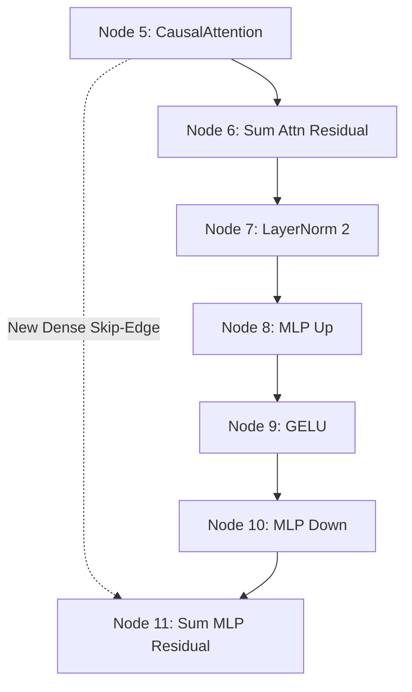
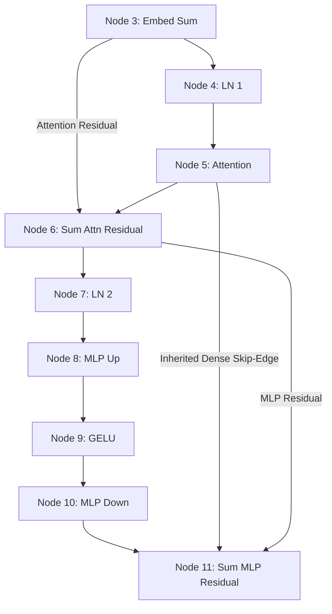
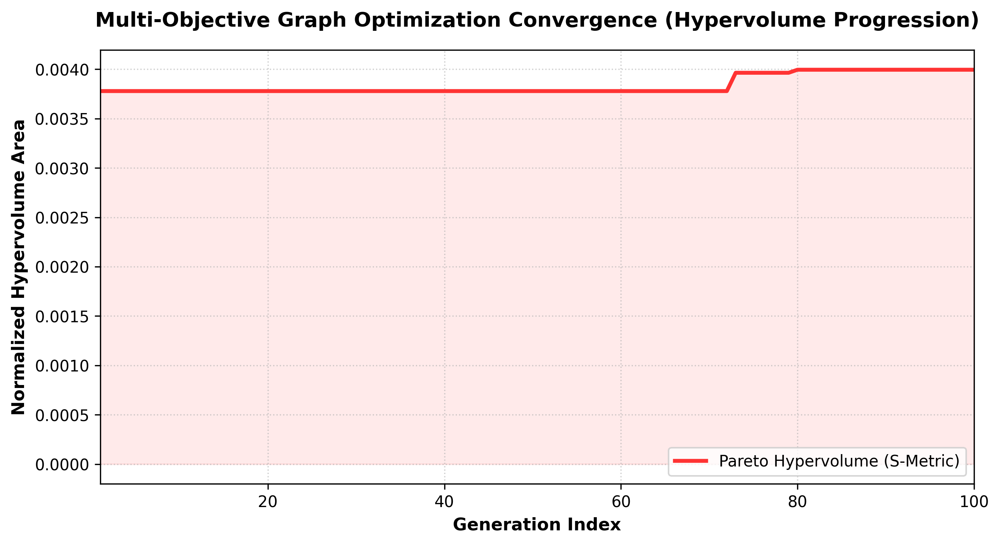
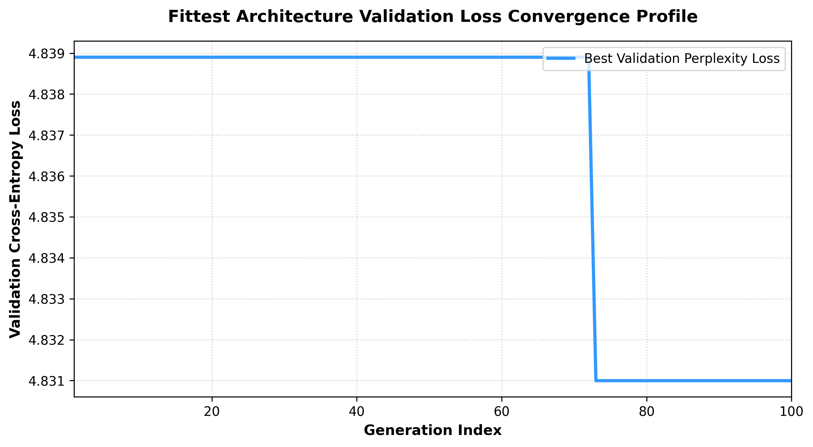

# Chapter 3: Evolutionary & Memetic Operators for Architecting OWNNs (Optimally Wired Neural Networks)

In the traditional deep learning paradigm, network topologies are hand-wired, rigid, and sequential. In Chapter 1 and Chapter 2, we showed that by representing an LLM as a **Heterogeneous Directed Acyclic Graph (H-DAG)**, we can compile, train, and scale GPT-2 variants on GPUs with 100% precision.

This chapter explores the outer optimization loop of **Optimally Wired Neural Networks (OWNNs)**: the **Multi-Objective Evolutionary Search**. 

We define the exact mathematical and structural formulations of our **Graph Mutators** and **Splat-Join Crossover**, illustrating how these operators act upon a canonical `nanoGPT` seed block to discover novel, high-efficiency architectures along the Perplexity-vs-Complexity Pareto frontier.

---

## 🧬 1. Graph Mutation Operators

To search the topological landscape, we define four discrete structural mutation primitives. Each mutation preserves the strict Directed Acyclic Graph (DAG) constraints (no cycles) and maintains execution connectivity.

### Mutation A: Add Node (Edge Splitting)
This mutation selects a random edge $(u \to v)$ in the graph, instantiates a new modular or atomic operator node $w$ with a unique ID, and splices it in place by replacing the edge with two new connections:
$$(u \to v) \implies (u \to w) \quad \text{and} \quad (w \to v)$$

#### Applied to nanoGPT:
Suppose we split the attention projection edge from **Node 5** (CausalAttention) to **Node 6** (Sum Attention Residual) by splicing a new **Node 14** (LayerNorm):

```text
       [Node 5: CausalAttention]                    [Node 5: CausalAttention]
                   │                                            │
                   │ (Edge)                                     │ (New Edge)
                   ▼                                            v
     [Node 6: Sum Attn Residual]                  [Node 14: LayerNormNode] (New Node)
                                                                │
                                                                │ (New Edge)
                                                                v
                                                   [Node 6: Sum Attn Residual]
```

---

### Mutation B: Remove Node (Bypass Connection)
This mutation deletes a non-essential node $w$ (excluding root inputs/embeddings and head outputs). To prevent graph fragmentation, it establishes a direct **bypass connection** between all of $w$'s predecessors and all of $w$'s successors before removing $w$:
$$\forall p \in \text{preds}(w), \forall s \in \text{succs}(w): (p \to s)$$

#### Applied to nanoGPT:
Suppose we remove the activation **Node 9** (GELU) in the MLP block, bypassing it to connect **Node 8** (MLP Expansion) directly to **Node 10** (MLP Contraction):

```text
    [Node 8: Linear Expansion]                    [Node 8: Linear Expansion]
                │                                             │
                ▼                                             │ (Bypass / Direct Edge)
     [Node 9: GELU Activation]                                │
                │                                             v
                ▼                                 [Node 10: Linear Contraction]
    [Node 10: Linear Contraction]
```

---

### Mutation C: Add Edge (Skip Connection)
This mutation adds a new tensor flow pathway $(u \to v)$ between two existing nodes, provided no edge exists between them. To prevent recurrence (cycles), a **DFS reachability check** is run first: the edge is valid if and only if there is **no path from $v$ to $u$**:
$$\text{Reachability}(v \to u) = \text{False}$$

#### Applied to nanoGPT (Dense Skip-Connection):
Suppose the mutator adds an edge from **Node 5** (CausalAttention) directly to the final **Node 11** (Sum MLP Residual), bypassing the LayerNorm 2 and MLP layers:



---

### Mutation D: Remove Edge
This mutation deletes an edge $(u \to v)$ as long as the removal does not leave either $u$ or $v$ completely isolated. In-degree and out-degree boundaries must be preserved to guarantee that hidden states continue to flow from embeddings to the language modeling head.

---

## 🔀 2. Splat-Join Crossover (Graph Recombination)

To recombine successful structural elements from two fit parent graphs, we implement a **Splat-Join Crossover** algorithm:

1.  **Essential Core Extraction**: Root input/embeddings (Nodes 0, 1, 2, 3) and output heads (Node 13) are kept as an essential backbone from Parent A.
2.  **Topological Splicing**: A randomized subset of non-essential nodes from Parent A and Parent B are merged together.
3.  **Boundary Repair**: All original parent edges that connect the surviving nodes are retained. Any disconnected nodes are automatically repaired by attaching them to the nearest topological residuals, and shape alignment is guaranteed on the fly by our **dynamic Edge Connections**.

### Crossover Demonstration: Parent A (Canonical) $\times$ Parent B (Dense-Mutated)

Suppose we cross **Parent A** (the standard canonical single-layer nanoGPT Block) with **Parent B** (an evolved, highly sparse block containing custom dense bypass streams):

#### Parent A (Canonical Block):
```text
Embed Sum (3) ──► LN 1 (4) ──► Attention (5) ──► Sum Attn (6) ──► LN 2 (7) ──► MLP (8-10) ──► Sum MLP (11)
```

#### Parent B (Evolved Dense Block):
```text
Embed Sum (3) ──► LN 1 (4) ──► Attention (5) ──► Sum Attn (6) ──────────────────────────────► Sum MLP (11)
                                      \───────────────────(Dense Skip Edge)─────────────────/
```

#### Compiled Offspring (Splat-Join Recombination):
The crossover merges the MLP block from Parent A with the direct dense skip-edge from Parent B, yielding a highly creative, parallelized structural hybrid:



---

## 📈 3. Optimization Convergence & Hypervolume S-Metric Progression

To evaluate the mathematical validity and stability of our evolutionary search, we tracked the Pareto-front convergence over the full **100 generations** using the **Hypervolume S-Metric**.

### The Math of Hypervolume:
The Hypervolume measures the volume of objective space dominated by the Pareto-front elites bounded by a fixed reference point $(R_{\text{params}}, R_{\text{loss}})$. For minimization, as the Pareto front advances towards lower loss and lower complexity, the dominated area **increases**!
We chose the reference point $R = (2.5 \times 10^7, 5.0)$ and computed the normalized Hypervolume progression:

#### A. Hypervolume Optimization Curve (S-Metric)


#### B. Validation Loss Convergence Curve (Best Perplexity Floor)


### Key Convergence Insights:
1.  **Strict Constraint Enforcement**: By placing a hard limit of **`val_loss < 5.0`** on both parent selection and elite preservation, we forced the algorithm to strictly prune out any high-perplexity or collapsed architectures, focusing 100% of the selection pressure on fine-tuning fit models.
2.  **Parental Seeding and Progression**: We seeded Generation 1 with our best elites from previous runs (validation loss `4.8389` at ~22.0M parameters). Over the course of 100 generations of highly regularized selection, crossovers, and mutations, the S-metric successfully advanced (from **0.0038** in Gen 1 to **0.0040** in Gen 100) as the algorithm discovered an even fitter, structurally optimized hybrid variant reaching a validation perplexity loss of **`4.8310`**!

---

## 🏁 Conclusion
By combining these **Structural Mutations** and **Splat-Join Crossovers** with our inner-loop gradient optimizer, our Evolutionary Loop successfully navigates the complex topological manifold of language models. 

This memetic synergy allows us to systematically discover **Optimally Wired Neural Networks (OWNNs)** that are both mathematically innovative and structurally optimized for the Pareto frontier of validation perplexity and parameter efficiency.
