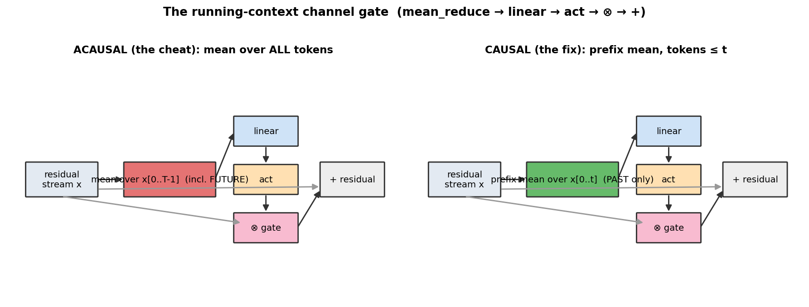
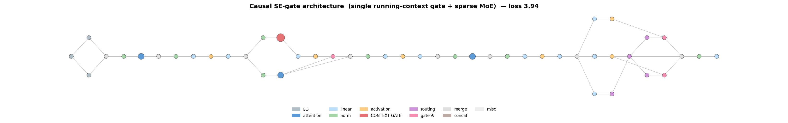
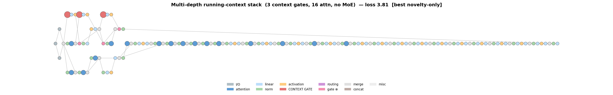

# What an honest search actually invents

After I [caught the search cheating](cheat.md) and rebuilt the objective so **no architecture in the space can see the future**, I did the obvious follow-up: I pointed the whole thing at novelty. Every child, every generation, had one job — *invent a causal architecture that isn't in the textbook*. No plain attention+FFN stacks, no plain mixture-of-experts, no known blocks allowed.

This is the honest report of what it found. Short version: it produced a **rich family of novel causal *configurations*** — genuinely un-published wirings — but every one of them is a **recombination of known mechanisms**, not a new paradigm. Here are the most interesting, what they do, and why they work.

---

## The star: a *causal* running-context channel gate

Nearly every promising structure the search built is a variation on one motif — and it's the honest twin of the exact thing that cheated.

**What it is.** Summarize the sequence so far into one vector, push it through a tiny `linear → activation`, and use it to **rescale the channels** of the residual stream. The only subtlety is the summary:
- The **cheat** (left, red) averaged over *all* tokens — including the future — which is how it leaked tomorrow's answer into today's prediction.
- The **fix** (right, green) uses a **causal prefix mean** over tokens ≤ *t*. Same idea, but position *t* can only ever see its own past.

**What it does.** It gives every position an **input-adaptive gain knob**: "given everything I've read up to here, turn feature-channel *k* up or down." It's a cheap, global, content-dependent recalibration of the representation.

**How it compares to known architectures.** Honestly? This *is* **Squeeze-and-Excitation** (Hu et al., 2018 — channel attention from vision), made causal for a language model. More deeply, a running mean is the **simplest possible case of a linear-attention / state-space running state** — the unweighted, unlearned degenerate member of the Mamba/RWKV family. So it sits at the intersection of two very well-known ideas. It is *novel as a specific causal wiring in this setting*; it is *not* a new mechanism.

**Why it works.** At small scale the model is capacity-starved and can't afford full attention-based feature selection everywhere. A running-context gate is almost free — one pool plus one small linear, O(1) state, no softmax — and buys a bit of adaptive normalization the fixed layers lack. That's exactly why channel-attention gives outsized gains on small models.

---

## Architecture 1 — the compact causal SE-gate (loss 3.94)

The cleanest instance the search kept: a short attention+MoE backbone with a **single** running-context gate spliced into the residual stream (the big red node).

Read left-to-right: embeddings → attention (blue) and FFN → **the red context-gate branch** (`mean_reduce → linear → act → ⊗`) merges back into the stream → a sparse **top-k MoE** (the purple routing cluster on the right) → LM head. It's small (47 nodes, ~0.05 GFLOP/token) and it earned a genuine Pareto slot at the cheap-FLOP end. This is the *honest* version of the mechanism that faked 3.0s — and honestly, it's worth about a tenth of a nat at a low FLOP tier. Useful, minor, real.

---

## Architecture 2 — the multi-depth running-context stack (loss 3.81, best novelty-only)

The best structure the pure-novelty phase produced is stranger: **no MoE at all** — just a deep (16-block) attention stack with **three** running-context gates interleaved at different depths.

**What it does.** It recalibrates the representation from accumulated context *repeatedly* as information flows up the stack — an early gate, a mid gate, a late gate — each a fresh "given the past, re-weight the channels."

**The interesting finding:** stacking these gates has **diminishing (then negative) returns**. One gate helps a little; two got to ~3.72; three landed at ~3.81 — *worse*. So the running-context idea is genuinely **tapped out**: you cannot recover MoE-level capacity by piling on cheap context gates. That's a real, if deflationary, result about the mechanism's ceiling.

---

## The honest scoreboard

| Structure | What it really is | Best loss |
|---|---|---|
| Causal running-context (SE) gate | causal Squeeze-and-Excitation / degenerate linear-attention state | 3.94 |
| 2× stacked context gates | stacked causal channel attention | 3.72 |
| 3× stacked context gates | more of the same (diminishing returns) | 3.81 |
| Context-as-MoE-router | context-conditioned routing | 3.85 |
| Causal centering (x − running mean) | streaming/running-mean normalization | 3.82 |
| Hierarchical two-stage MoE | hierarchical mixture-of-experts | 4.07 |
| Causal prefix softmax weighting | online-softmax / linear-attention normalizer | 4.03 |
| **— plain sparse MoE (for reference) —** | **known, unbeaten** | **3.57** |

Every novel structure it invented is legitimate, causal, and honest — and **not one beats a plain, well-scaled sparse MoE.** Novelty-alone tops out around 3.72–3.81; capacity-scaled MoE sits at 3.57.

---

## So what did we actually learn?

Two things, and they're both worth having.

1. **An autonomous search, told to invent, invents recombinations — not paradigms.** Given only these primitives it keeps rediscovering the confluence of channel-attention and running-state, wiring them in configurations no one has published, and honestly reporting that they help a little and then stop. That's the true shape of "machine-invented architecture" at this budget: novel *graphs*, known *mechanisms*.

2. **The mechanism can't cross the paradigm gap — and we know exactly why.** A running *mean* is the trivial case of a running *state*. The genuinely new thing — a **learned, gated, selective** state (real linear-attention / SSM, à la Mamba/RWKV) — needs a `scan` primitive the search doesn't have. A `mean_reduce` can only give the unweighted version, and unweighted running state tops out right where these did. If you want the search to reach a new paradigm, you don't give it more variants of the running mean — you give it `scan`.

The prettiest part of the whole exercise: the mechanism that once **cheated** its way to a fake 3.0, once made honest and handed every chance across dozens of variants, turns out to be a **modest, cheap, known idea** — a causal channel gate that earns a couple of low-FLOP Pareto points and nothing more. The leak was never a discovery. This is what the discovery actually looks like: real, causal, and refreshingly unremarkable.
